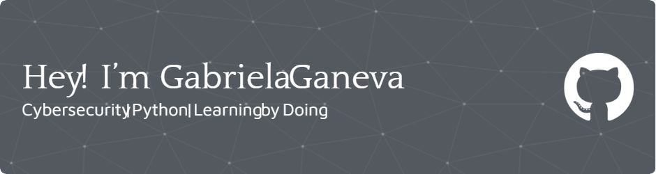

<!--
**ganevaaaa/ganevaaaa** is a ✨ _special_ ✨ repository because its `README.md` (this file) appears on your GitHub profile.

Here are some ideas to get you started:

- 🔭 I’m currently working on ...
- 🌱 I’m currently learning ...
- 👯 I’m looking to collaborate on ...
- 🤔 I’m looking for help with ...
- 💬 Ask me about ...
- 📫 How to reach me: ...
- 😄 Pronouns: ...
- ⚡ Fun fact: ...
-->

  

Hi 👋 My name is Gabriela Ganeva
================================

I'm a Computer Science student passionate about cybersecurity and practical problem-solving. I enjoy building tools that simulate real-world threats, like my Python-based web vulnerability scanner. Through hands-on projects, I'm developing skills in network security, secure coding, and threat analysis.

I like working on projects that have real-world impact and help strengthen digital security. I'm always eager to collaborate, share knowledge, and keep learning from others in the field.

*   🚀  I'm currently working on [Web vulnerability scanner](http://github.com/ganevaaaa/web-vuln-scanner)
*   🧠  I'm learning Web application security , threat modeling (STRIDE) and  ISO/IEC 27001. 
*   🤝  I'm open to collaborating on Cool cybersecurity side quests, consulting-style audit projects, building  tools, or anything that breaks stuff (legally)
